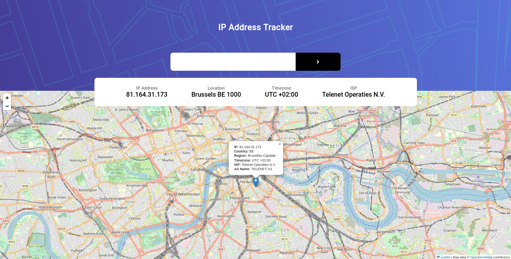
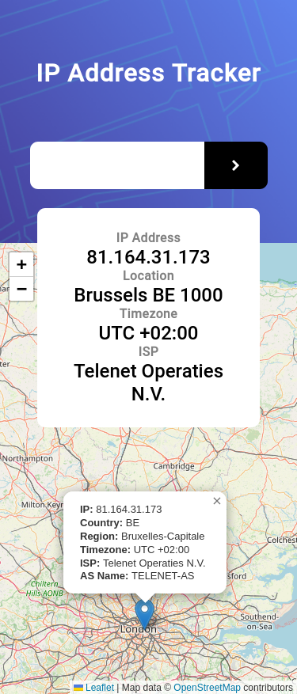

# Frontend Mentor - IP address tracker solution

This is a solution to the [IP address tracker challenge on Frontend Mentor](https://www.frontendmentor.io/challenges/ip-address-tracker-I8-0yYAH0). Frontend Mentor challenges help you improve your coding skills by building realistic projects. 

## Table of contents

- [Overview](#overview)
  - [The challenge](#the-challenge)
  - [Screenshot](#screenshot)
  - [Links](#links)
- [My process](#my-process)
  - [Built with](#built-with)
  - [What I learned](#what-i-learned)
  - [Continued development](#continued-development)
  - [Useful resources](#useful-resources)
- [Author](#author)
- [Acknowledgments](#acknowledgments)

**Note: Delete this note and update the table of contents based on what sections you keep.**

## Overview

### The challenge

Users should be able to:

- View the optimal layout for each page depending on their device's screen size
- See hover states for all interactive elements on the page
- See their own IP address on the map on the initial page load
- Search for any IP addresses or domains and see the key information and location

### Screenshot




**Note: These are just examples. Delete this note and replace the list above with your own choices**

### What I learned


```js
const mobileDesign = window.matchMedia("(max-width: 375px)");
const desktopDesign = window.matchMedia("(min-width: 376px)");
///////////////header backgroud Image///////////////////
const changeBackgroundImage = () =>{
    if(mobileDesign.matches){
        header.style.backgroundImage='url(images/pattern-bg-mobile.png)'
      
    }  else{
        header.style.backgroundImage ='url(images/pattern-bg-desktop.png)'
    }
}
// Call the initial function to set the background image on the initial page load
changeBackgroundImage();

// Add event listeners for screen size changes
mobileDesign.addListener(changeBackgroundImage);
desktopDesign.addListener(changeBackgroundImage);
```


```css
header {
  background-size: cover;

}
```

### Continued development

improve responsivity :
- tab display
- improve mobile display


## Author

- Frontend Mentor - [@azizabacc](https://www.frontendmentor.io/profile/azizabacc)

